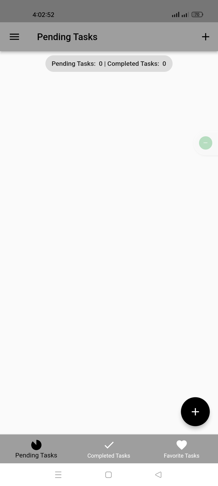
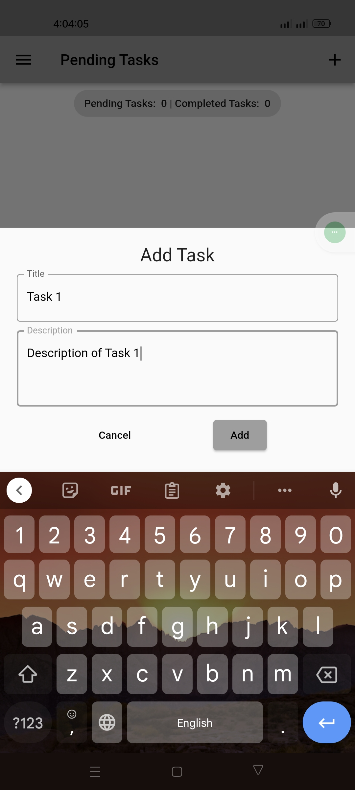
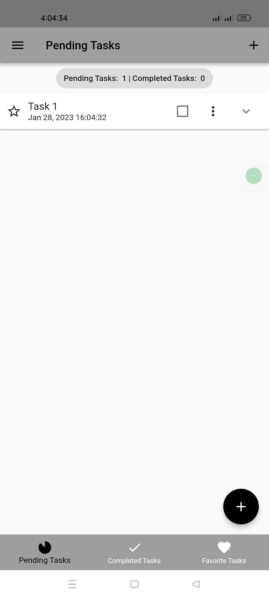
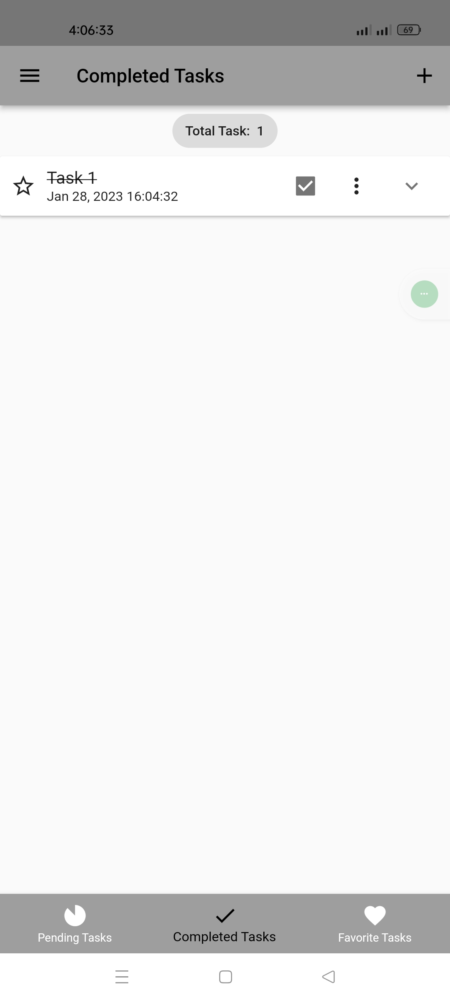
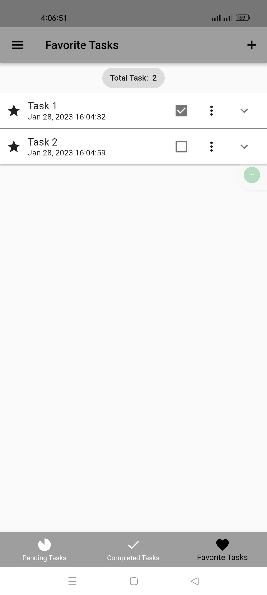
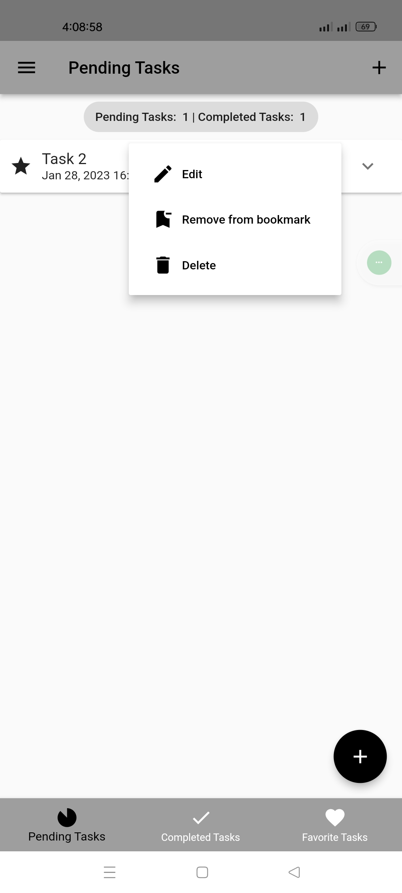
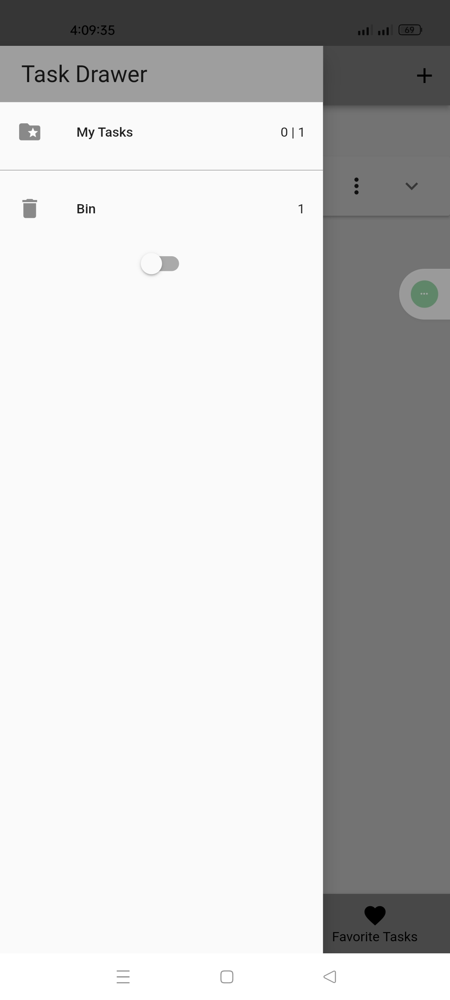
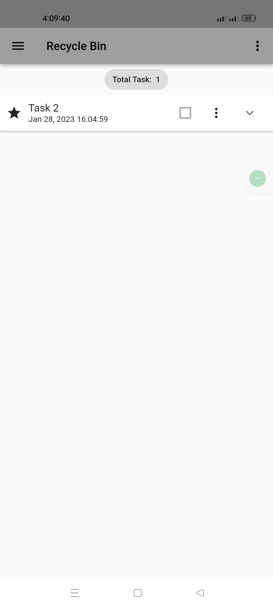
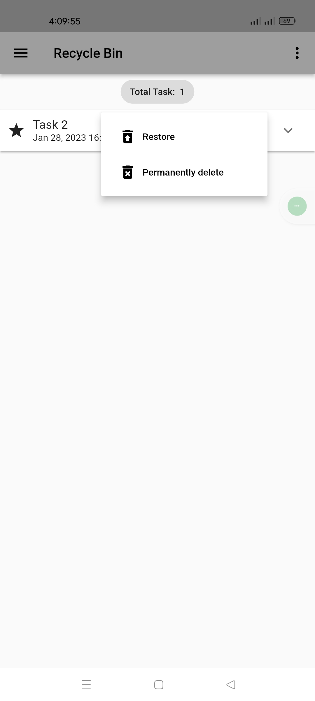
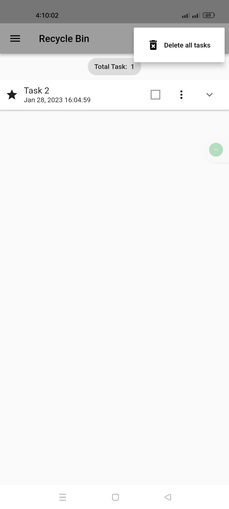

# Daily Plans

A simple project about manage your daily tasks.

## Tools and Technologies:
1. Flutter framework.
2. Dart programming language.

## Packages:
1. shared preferences (For save token in local storage)
2. http (For http request)
3. flutter bloc (for state management)
4. equatable (for compare objects in dart)
5. hydrated bloc (for persists and restores bloc and cubit states automatically)
6. path provider
7. intl

## Features:
1. Add task.
2. Update task.
3. Add task as favorite.
4. Add task as completed.
5. Delete task.
6. Restore task from bin.
7. Theme change.

# Screenshots
## Light theme:

